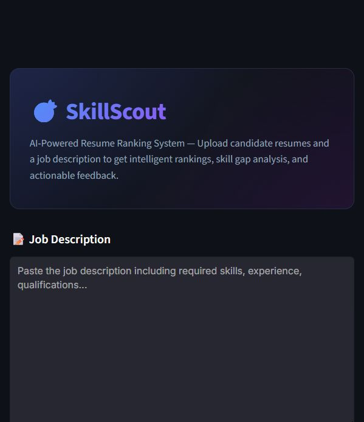
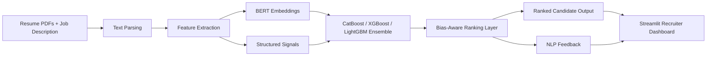
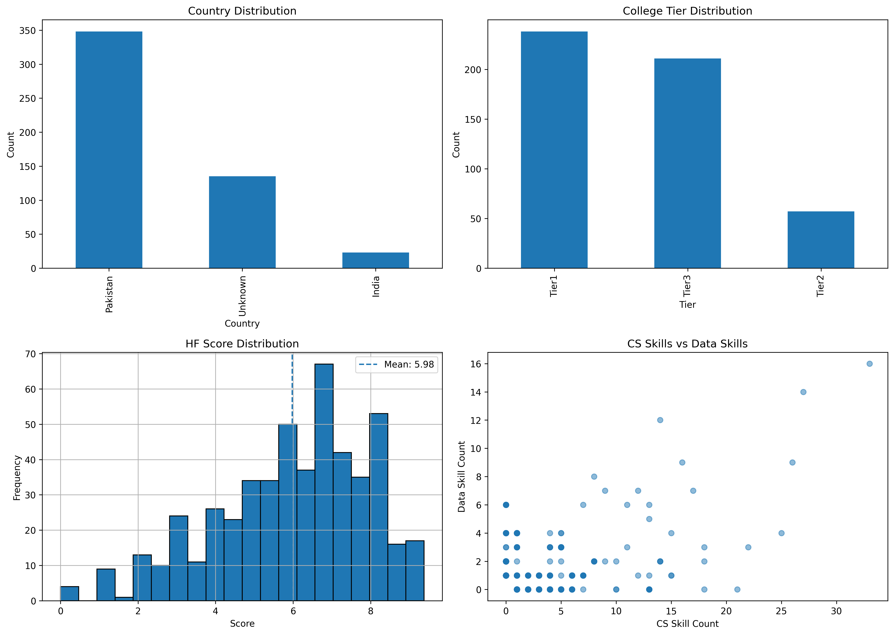
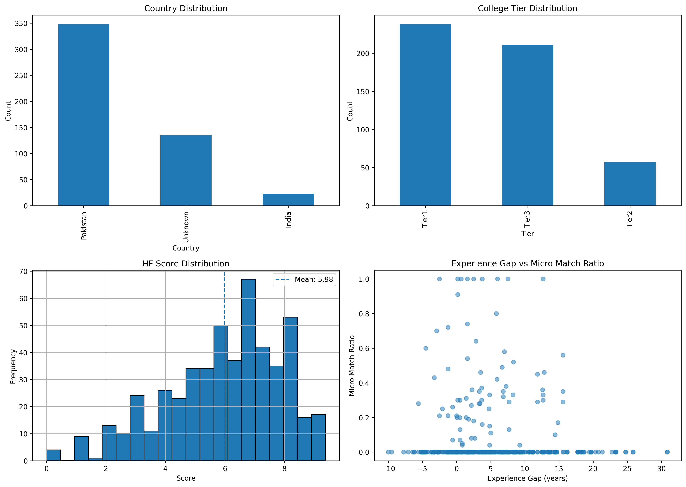

# SkillScout

**AI-powered resume-to-job-description matching with bias-aware ranking and recruiter-ready feedback.**


SkillScout helps recruiters compare resumes against a target job description using semantic NLP features, structured profile signals, and a stacked machine learning ensemble. It combines BERT-style sentence embeddings with CatBoost, XGBoost, and LightGBM models to produce ranked candidate outputs and natural-language feedback.

The project is designed for practical hiring workflows: upload resumes, paste a job description, review match scores, inspect missing skills, and use the generated feedback as decision support. It also includes bias-mitigation hooks for name-based and college-tier signals in the Indian hiring context.

## App Preview



## Features

- Resume-to-job-description matching using semantic embeddings and structured features
- BERT/SentenceTransformer embeddings for resume and job description text
- Stacked CatBoost, XGBoost, and LightGBM inference pipeline
- Streamlit dashboard for recruiter-facing resume review
- Bias-aware handling of name and college-tier signals
- NLP-generated candidate feedback with fit summaries and improvement areas
- Downloadable ranked reports for recruiter workflows
- Organized app, source, model, data, notebook, and asset folders

## Architecture

SkillScout extracts text from uploaded PDFs, builds semantic and structured features, generates embeddings, scores candidates with an ensemble model, applies bias-aware handling, and returns ranked results with explanatory feedback.



## Tech Stack

| Area | Tools |
| --- | --- |
| Language | Python |
| App | Streamlit |
| NLP | HuggingFace Transformers, Sentence Transformers, BERT-style embeddings |
| Machine Learning | Scikit-learn, CatBoost, XGBoost, LightGBM |
| Data | Pandas, NumPy, SciPy |
| Resume Parsing | pdfplumber, PyPDF2 |
| Model Artifacts | Joblib, Pickle, CatBoost model files |
| Output | Ranked table, candidate score, fit rationale, downloadable CSV |

## Repository Layout

```text
skillScout/
|-- app/
|   `-- app.py
|-- src/
|   `-- skillscout/
|       |-- inference_pipeline.py
|       |-- ranking_feedback_nlp.py
|       `-- __init__.py
|-- models/
|   `-- production model artifacts and encoders
|-- data/
|   |-- reference/
|   |-- raw/              # ignored locally
|   |-- private_resumes/  # ignored locally
|   `-- outputs/          # ignored locally
|-- notebooks/
|   `-- project.ipynb
|-- assets/
|   `-- analysis plots and README media
|-- scripts/
|-- requirements.txt
|-- Makefile
|-- .gitattributes
|-- .github_description.txt
|-- .github_topics.txt
`-- README.md
```

## Getting Started

Clone the repository:

```bash
git clone https://github.com/YOUR_USERNAME/skillScout.git
cd skillScout
```

Create and activate a virtual environment:

```bash
python -m venv .venv
```

Python 3.10-3.12 is recommended for the ML dependency stack.

Windows:

```bash
.venv\Scripts\activate
```

macOS/Linux:

```bash
source .venv/bin/activate
```

Install dependencies:

```bash
pip install -r requirements.txt
```

Run the Streamlit app:

```bash
streamlit run app/app.py
```

If `make` is available, you can use:

```bash
make setup
make run
make lint
```

## Usage

1. Open the Streamlit app.
2. Paste the target job description.
3. Upload one or more resume PDFs.
4. Run the ranking pipeline.
5. Review candidate match scores, confidence signals, missing skills, and generated feedback.
6. Download the ranked CSV report for shortlisting or hiring review.

Scores should be treated as decision support, not final hiring decisions. Recruiters and hiring teams should combine SkillScout output with structured interviews, work samples, and role-specific evaluation rubrics.

## Bias Mitigation Notes

SkillScout includes bias-aware handling for signals that can affect resume screening in the Indian hiring context, including candidate names and college-tier indicators. The intent is to reduce over-reliance on proxy signals and keep the ranking focused on job-relevant evidence such as skills, experience, semantic job fit, and requirement coverage.

What this project does:

- Separates semantic and structured matching signals from sensitive or proxy attributes
- Includes college-tier handling through encoded features rather than raw prestige labels
- Provides feedback that focuses on skills, experience alignment, and requirement fit
- Keeps the ranking process inspectable for recruiters and ML engineers

What this project does not claim:

- It does not guarantee legally compliant or bias-free hiring decisions
- It does not replace human review, interview design, or fairness audits
- It does not validate every resume format or every hiring domain out of the box

## Model Artifacts

The app expects production artifacts in `models/`, including:

- `stack_cat.pkl`
- `stack_xgb.pkl`
- `stack_lgb.pkl`
- `stack_meta.pkl`
- `pca_resume.pkl`
- `pca_jd.pkl`
- `tier_encoder.pkl`

Large raw datasets, private resumes, generated outputs, and embedding dumps are ignored under `data/raw/`, `data/private_resumes/`, and `data/outputs/`.

## Screenshots

| Dashboard | Ranking Results | Candidate Feedback |
| --- | --- | --- |
|  |  |  |

## Analysis Artifacts

These plots are included as project artifacts to show the analysis workflow behind the ranking pipeline.

| Dataset Analysis | Match + Experience | Match + Justification |
| --- | --- | --- |
|  |  |  |

## Developer Commands

```bash
make setup   # create .venv and install requirements
make run     # run streamlit run app/app.py
make lint    # compile app and src to catch syntax/import issues
```

Without `make`, use:

```bash
python -m compileall app src
streamlit run app/app.py
```

## Troubleshooting

**ModuleNotFoundError: skillscout**

Run the app from the repository root:

```bash
streamlit run app/app.py
```

**Missing model artifact**

Confirm the required files are present in `models/`. The inference pipeline resolves model paths relative to the project root.

**Dependency install issues**

Upgrade `pip` first, then reinstall:

```bash
python -m pip install --upgrade pip
pip install -r requirements.txt
```

**PDF text extraction looks empty**

Some resumes are scanned images rather than text-based PDFs. OCR support is not currently included.

## Roadmap

- Add anonymized sample resumes and sample job descriptions
- Add unit tests for parsing, feature extraction, and inference path validation
- Add fairness metrics and model-card documentation
- Add CI for compile checks and dependency validation
- Package `src/skillscout` as an installable Python package

## Contributing

Contributions are welcome from ML engineers, recruiters, and open-source contributors. Useful areas include resume parsing, fairness evaluation, model documentation, app UX, tests, and sample datasets.

To contribute:

1. Fork the repository.
2. Create a feature branch.
3. Make a focused change.
4. Run `make lint` or `python -m compileall app src`.
5. Open a pull request with a clear summary and screenshots when relevant.

## License

This project is licensed under the MIT License. See [LICENSE](LICENSE) for details.

## Disclaimer

SkillScout is an assistive screening tool. It should be used with transparent hiring policies, human review, and ongoing fairness checks.
